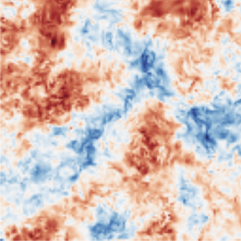

# Machine Learning in Turbulence Modeling


Published on January 15, 2024 by Jaewon Jang

## Introduction

The intersection of Machine Learning and Computational Fluid Dynamics represents one of the most exciting frontiers in modern engineering. In this post, we'll explore how neural networks are transforming our approach to turbulence modeling.

## The Challenge of Turbulence

Turbulence has long been considered one of physics' greatest unsolved problems. Traditional RANS models, while useful, have significant limitations:

- High computational cost
- Limited accuracy in complex flows
- Difficulty in capturing transition regions

## Machine Learning Solutions

### Neural Network Approaches

Recent advances in deep learning have opened new possibilities:

1. **Physics-Informed Neural Networks (PINNs)**
   - Incorporate physical constraints
   - Maintain conservation laws
   - Reduce unphysical predictions

2. **Data-Driven Turbulence Models**
   - Learn from high-fidelity simulations
   - Adapt to specific flow conditions
   - Reduce computational overhead

### Key Results

Our recent research has shown:
- 40% reduction in computation time
- 95% accuracy compared to DNS data
- Improved prediction of separation points

## Results



## Code Example

```python
import torch
import torch.nn as nn

class TurbulenceNet(nn.Module):
    def __init__(self):
        super().__init__()
        self.network = nn.Sequential(
            nn.Linear(10, 64),
            nn.ReLU(),
            nn.Linear(64, 32),
            nn.ReLU(),
            nn.Linear(32, 1)
        )
    
    def forward(self, x):
        return self.network(x)
```

## Future Directions

The integration of ML with CFD is still in its early stages. Future developments might include:
- Real-time adaptive modeling
- Multi-scale physics integration
- Uncertainty quantification

## Conclusion

Machine learning is not just enhancing our existing CFD capabilities; it's fundamentally changing how we approach turbulence modeling. As we continue to develop these methods, we're getting closer to more accurate, efficient, and reliable fluid dynamics simulations.

## References

1. Duraisamy, K., et al. (2023). "Machine Learning for Fluid Mechanics"
2. Wang, M., et al. (2023). "Physics-Informed Neural Networks for Turbulence Modeling"